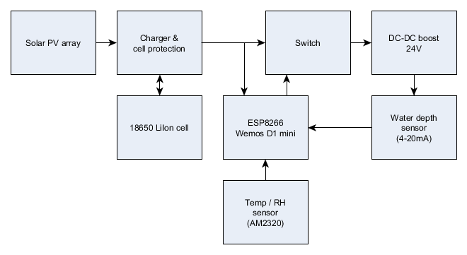
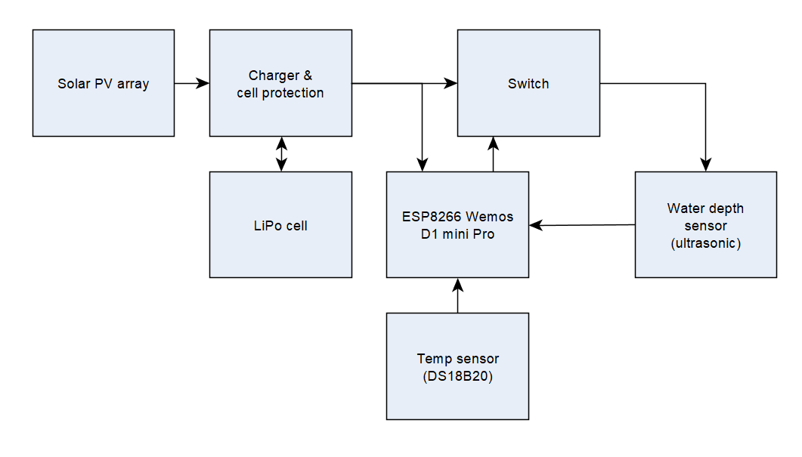

# A simple IoT tank level monitor for NodeMCU / Lua which measures and and submits level by [RESTful API](https://en.wikipedia.org/wiki/Representational_state_transfer).



Above is a block diagram of the telemetry system using a 4-20mA depth sensor.



Above is a block diagram of the telemetry system using an ultrasonic sensor (HC-SR04, MB1242, GY-US42v2).

To use the code, copy init.default.lua to init.lua, and nodevars.default.lua to nodevars.lua and customise the latter to suit your needs.


The code supports HTTP GET and POST.

Example URLs for the REST host are:

* Thingspeak: http://api.thingspeak.com/update
* Emoncms: http://emoncms.org/input/post


Edit the httpgetreq() definitition in init.lua to suit your REST host, eg:

```lua
function httpreq() 
  req=rest_url.."?api_key="..apikey.."&field1="..level.."&field2="..temperature.."&field3="..humidity
  body=""
  print("req:"..req.."\nbody:"..body)
  return req,body
end
```
 
GET requests are usually fairly easy to get going, but you may find the RESTED add-in for Firefox and Chrome to be useful, also http://httpbin.org/get for testing.

The deep sleep function used depends on an external connection which you must make for it to work properly: connect a SB or germainium diode anode to RST, cathode to GPIO16 (D0).
 
Tested on float firmware:

```
NodeMCU 3.0.0.0 built on nodemcu-build.com provided by frightanic.com
	branch: release
	commit: d4ae3c364bd8ae3ded8b77d35745b7f07879f5f9
	release: 
	release DTS: 202105102018
	SSL: true
	build type: float
	LFS: 0x0 bytes total capacity
	modules: adc,bit,bme280_math,dht,encoder,file,gpio,http,i2c,mdns,mqtt,net,node,ow,sntp,spi,tmr,uart,wifi,tls
 build 2021-06-10 08:45 powered by Lua 5.1.4 on SDK 3.0.1-dev(fce080e)
```

# Programming a bare ESP8266 board

You need to build and download a firmware module with all the above modules, and install it on the ESP8266 so that it becomes a NodeMCU.
When you start it, it will build an empty filesystem.

Then upload all of the project *.lua files to the file system, Esplorer is recommended.

# Configuration of a loaded NodeMCU

After loading all the necessary files onto the NodeMCU, it needs configuring.

Press the reset button and hold GPOI0 low for 5s. Then connect to the AP created and connect to the web server at 192.168.1.1 and fill in
the configuration form and save it. The defaults for this form are in init.lua.

## Devkit v1.0 compatible boards and Esplorer

This is easily done on Devkit v1.0 comptabitle boards with Esplorer where you hit and release RTS and hold DTR for 5s.

## Other

Hit reset and then ground D3 for 5s.

# Calibration
There are a lot of ways to go about calibration and scaling of the output, and the code has been written to be flexible. Here is a simple example.

Lets say the tank holds 15,000l when full, is 3m deep, and we are using a 4m 4-20mA sensor, and lets say you want to display litres in the tank.

## Gather calibration raw values

Start by configuring the device to connect to the display service, wet meas_intercept=0 and meas_slope=1.

Set the sensor to some depth (eg minimum), write down the input value (in intended display units) (A) displayed quantity (B).

Set the sensor to some other depth (well away from the first), write down the input value (in intended display units) (C) displayed quantity (D).

Set the sensor to some other depth (well away from the last), write down the displayed value (C) and that depth (in intended display units) (D).

In our example, A=0, B=199, C=12,000, D=474.

It is possible with this scheme to offset the base of the displayed value, and to scale the displayed value to end-user units,
and the calibration process offsets errors in the sensor, ESP8266 a0 voltage divider and MCU voltage reference.

## Calculate calibration constants

meas_slope=(C-A)/(D-B)=43.636 (use at least four significant digits)

meas_intercept=((A+C)-meas_slope*(B+D))/2=-8684.6

set meas_fmt to %0.0f for 0 decimal point precision (%0.2f for 2 decimal points precision... got it).

## Set calibration constants

Start configuring the device to connect to the display service, and set meas_intercept meas_slope, and meas_fmt to the new calculated values.

Useful calculator tool: [4-20mA calibration constants calculator](http://owenduffy.net/calc/4-20cal.htm)

# FAQ

[FAQ](FAQ.md).


***
